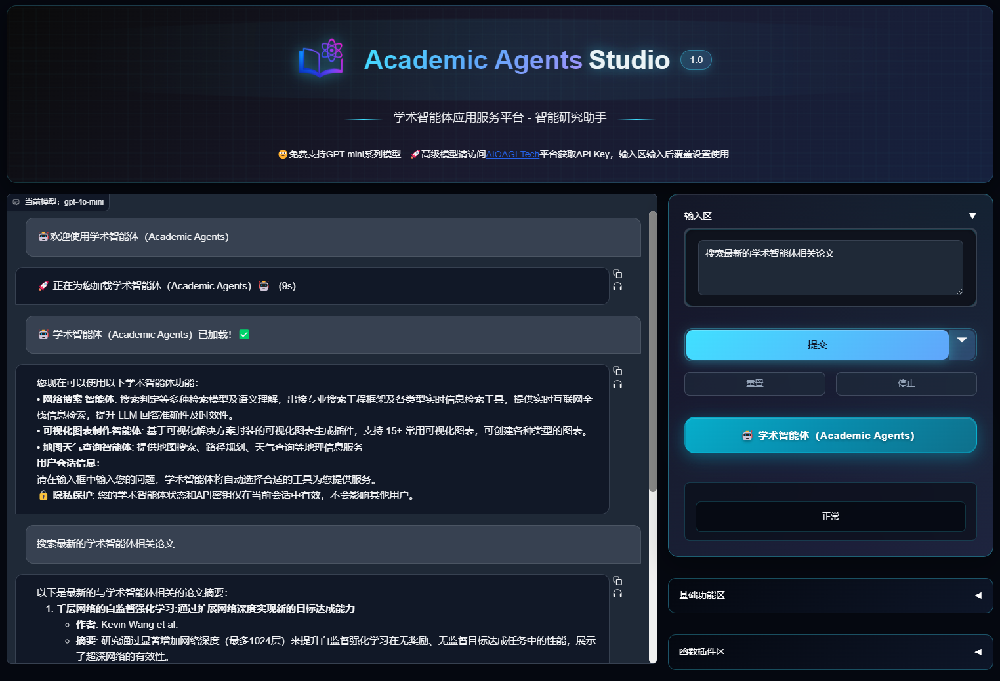

<p align="right">
   <strong>中文</strong> | <a href="./docs/README.en.md">English</a>
</p>

<div align="center">


# Academic Agents Studio

### 🤖 新一代学术智能体应用服务平台

<p>
<strong>基于AI智能体驱动的学术研究全流程智能化平台</strong><br>
支持论文写作、文献分析、代码解释、多语言翻译等学术场景
</p>

[![Github][Github-image]][Github-url]
[![License][License-image]][License-url]
[![Python][Python-image]][Python-url]
[![Gradio][Gradio-image]][Gradio-url]
[![Stars][Stars-image]][Stars-url]

[Github-image]: https://img.shields.io/badge/GitHub-Repository-black?style=flat-square&logo=github
[License-image]: https://img.shields.io/badge/License-MIT-orange?style=flat-square
[Python-image]: https://img.shields.io/badge/Python-3.9+-blue?style=flat-square&logo=python
[Gradio-image]: https://img.shields.io/badge/Gradio-Web%20UI-yellow?style=flat-square
[Stars-image]: https://img.shields.io/github/stars/AcademicAgentsStudio?style=flat-square

[Github-url]: https://github.com/AcademicAgentsStudio
[License-url]: https://github.com/AcademicAgentsStudio/blob/master/LICENSE
[Python-url]: https://www.python.org/
[Gradio-url]: https://gradio.app/
[Stars-url]: https://github.com/AcademicAgentsStudio/stargazers

</div>

---

## 🎯 项目简介

**Academic Agents Studio** 是一个面向中科院学术版 GPT 深度优化的新一代学术版智能体平台。我们专注于为学术研究人员、教育工作者和学生提供全方位的AI智能体辅助平台。

### ✨ 核心特色

- 🔬 **学术专精**：针对学术场景深度优化，支持多种学术任务
- 🌐 **多模型支持**：集成GPT、Claude、文心一言、通义千问等主流AI模型
- 🤖 **MCP智能体支持**：集成Model Context Protocol，支持外部工具调用和智能体扩展
- 📚 **文档处理**：支持PDF、LaTeX、Markdown等多种格式的智能处理
- 🎨 **界面友好**：基于Gradio构建，支持暗色模式和多种主题
- ✨ **输入区优化**：全新设计的科技感输入界面，支持多行输入、文件拖拽、智能提示
- 🔧 **高度可定制**：支持自定义插件和快捷键，满足个性化需求
- 🚀 **部署简单**：支持本地部署、Docker部署和云端部署

## 🔧 主要功能

<div align="center">

| 功能类别 | 核心功能 | 说明 |
|---------|---------|------|
| 🤖 **AI模型** | 多模型支持 | OpenAI GPT系列、Claude、文心一言、通义千问、智谱GLM等 |
| 🔗 **MCP智能体** | 外部工具调用 | 支持AntV可视化图表、高德地图服务、网络搜索等MCP工具 |
| | 多用户隔离 | 每个用户独立的MCP状态和API密钥，确保隐私安全 |
| | 一键启用 | 通过"学术智能体（MCP Server）"按钮快速启用MCP功能 |
| 📄 **文档处理** | PDF解析翻译 | 一键翻译学术论文，保持格式和公式 |
| | LaTeX处理 | 支持LaTeX论文润色、翻译、语法检查 |
| | Markdown转换 | 智能转换和格式化Markdown文档 |
| 🔍 **学术工具** | Arxiv论文助手 | 快速获取和翻译Arxiv论文 |
| | 文献综述生成 | 基于多篇论文生成综合性文献综述 |
| | 代码解释分析 | 深度解析各种编程语言代码 |
| 🎨 **可视化** | 流程图生成 | 支持Mermaid图表、脑图、甘特图等 |
| | 公式渲染 | LaTeX公式的可视化渲染和编辑 |
| 🔊 **交互增强** | 语音对话 | 实时语音输入和TTS语音输出 |
| | 虚空终端 | 自然语言调用各种插件功能 |
| 💫 **界面优化** | 科技感输入区 | 渐变背景、毛玻璃效果、动态边框发光动画 |
| | 智能交互 | 多行输入、文件拖拽、快捷键提示、状态反馈 |
| 🛠️ **扩展性** | 插件系统 | 丰富的插件库和自定义插件支持 |
| | 主题定制 | 多种界面主题和个性化设置 |





</div>

## 🚀 快速开始

### 环境要求

- **Python**: 3.9-3.11 (推荐 3.10)
- **操作系统**: Windows、Linux、macOS
- **内存**: 建议4GB以上
- **网络**: 访问AI模型API需要稳定网络连接

### 一键安装 (推荐)

```bash
# 克隆项目
git clone https://github.com/AcademicAgentsStudio.git
cd AcademicAgentsStudio

# 安装依赖
pip install -r requirements.txt

# 配置API Key (在config.py中)
# API_KEY = "your-api-key-here"

# 启动应用
python main.py
```

### Docker 部署

```bash
# 拉取镜像
docker pull aioagi/academic-agents-Studio:latest

# 运行容器
docker run -d -p 7860:7860 \
  -e API_KEY="your-api-key" \
  aioagi/academic-agents-Studio:latest
```

访问 `http://localhost:7860` 即可使用。

## 🤖 MCP智能体功能

### ✨ 全新的MCP (Model Context Protocol) 支持

Academic Agents Studio 集成了先进的MCP协议，为用户提供强大的外部工具调用能力，让AI智能体能够访问真实的数据和服务。

#### 🌟 核心特色

- **🔗 外部工具集成**：支持调用外部API和服务，如地图、可视化、搜索等
- **🛡️ 多用户隔离**：每个用户独立的MCP状态和API密钥，确保数据安全
- **⚡ 一键启用**：通过基础功能区的"学术智能体（MCP Server）"按钮快速开启
- **🔧 配置简单**：预配置多个实用的MCP服务，开箱即用

#### 🛠️ 预配置的MCP服务

| 服务名称 | 功能描述 | 使用场景 |
|---------|---------|---------|
| **🎨 AntV 可视化图表** | 专业数据可视化工具 | 生成各种图表、数据分析可视化 |
| **🗺️ 高德地图服务** | 地理信息服务 | 地图搜索、路径规划、天气查询 |
| **🔍 网络搜索服务** | 实时信息检索 | 网络搜索、信息获取、实时数据 |

#### 🚀 使用方法

1. **启用MCP功能**
   ```
   在界面中点击"学术智能体（MCP Server）"按钮
   系统将自动检测和配置可用的MCP服务
   ```

2. **开始智能对话**
   ```
   启用后直接在输入框中提问
   AI会自动选择合适的工具进行调用
   ```

3. **示例对话**
   ```
   🎨 数据可视化：
   "帮我生成一个销售数据的柱状图"

   🗺️ 地图查询：
   "北京今天的天气怎么样？"

   🔍 信息搜索：
   "最新的AI技术发展趋势"
   ```

#### 🔒 隐私与安全

- **会话隔离**：每个用户的MCP状态完全独立，互不影响
- **API密钥安全**：优先使用用户提供的API密钥，确保数据安全
- **状态管理**：MCP状态存储在用户会话中，刷新后自动清除

#### ⚙️ 高级配置

可以通过修改 `mcp_config.py` 文件添加自定义MCP服务：

```python
# 添加新的MCP服务
"custom-service": MCPServerConfig(
    name="自定义服务",
    url="https://your-mcp-server.com/sse",
    headers={"Authorization": "Bearer your-api-key"},
    description="您的自定义MCP服务描述",
    enabled=True
)
```

> 💡 **提示**：MCP功能让您能够通过自然语言与各种外部服务进行交互，大大扩展了AI助手的能力边界。

## 🎨 界面优化亮点

### ✨ 全新设计的科技感输入区

我们对输入区进行了全面的UI/UX优化，带来更现代、更科技感的用户体验：

#### 🌟 视觉效果优化
- **渐变背景**：采用深蓝色科技风格渐变背景
- **毛玻璃效果**：backdrop-filter 模糊效果，增强层次感
- **动态边框发光**：实时渐变边框动画，科技感十足
- **精美阴影**：多层次阴影效果，提升视觉深度

#### 🚀 交互体验提升
- **智能提示**：更详细的placeholder提示信息
- **多行输入**：支持多行文本输入和自适应高度
- **文件拖拽**：直接拖拽文件到输入区进行上传
- **快捷键提示**：内置快捷键操作指引
- **状态反馈**：实时状态提示和智能反馈

#### 🎯 按钮交互优化
- **立体设计**：3D视觉效果的按钮设计
- **悬停动画**：流畅的hover和active状态转换
- **发光效果**：按钮边框和图标的发光动画
- **响应式布局**：完美适配各种屏幕尺寸

#### 🌙 主题适配
- **亮色模式**：清新明亮的界面风格
- **暗色模式**：深色主题下的专门优化
- **动态切换**：主题切换时的平滑过渡效果

> 💡 **设计理念**：在保持所有原有功能的基础上，通过现代化的UI设计语言，创造更直观、更高效的学术研究工作环境。

</div>


</div>


- 新界面（修改`config.py`中的LAYOUT选项即可实现“左右布局”和“上下布局”的切换）


- 所有按钮都通过读取functional.py动态生成，可随意加自定义功能，解放剪贴板


- 润色/纠错


- 如果输出包含公式，会以tex形式和渲染形式同时显示，方便复制和阅读


- 懒得看项目代码？直接把整个工程炫ChatGPT嘴里

- 多种大语言模型混合调用（ChatGLM + OpenAI-GPT3.5 + GPT4）


# Installation

```mermaid
flowchart TD
    A{"安装方法"} --> W1("I 🔑直接运行 (Windows, Linux or MacOS)")
    W1 --> W11["1 Python pip包管理依赖"]
    W1 --> W12["2 Anaconda包管理依赖（推荐⭐）"]

    A --> W2["II 🐳使用Docker (Windows, Linux or MacOS)"]

    W2 --> k1["1 部署项目全部能力的大镜像（推荐⭐）"]
    W2 --> k2["2 仅在线模型（GPT, GLM4等）镜像"]
    W2 --> k3["3 在线模型 + Latex的大镜像"]

    A --> W4["IV 🚀其他部署方法"]
    W4 --> C1["1 Windows/MacOS 一键安装运行脚本（推荐⭐）"]
    W4 --> C2["2 Huggingface, Sealos远程部署"]
    W4 --> C4["3 其他 ..."]
```



### 安装方法I：直接运行 (Windows, Linux or MacOS)

1. 下载项目

    ```sh
    git clone --depth=1 https://github.com/AcademicAgentsStudio.git
    cd gpt_academic
    ```

2. 配置API_KEY等变量

    在`config.py`中，配置API KEY等变量。[特殊网络环境设置方法](https://github.com/AcademicAgentsStudio/issues/1)、[Wiki-项目配置说明](https://github.com/AcademicAgentsStudio/wiki/项目配置说明)。

    「 程序会优先检查是否存在名为`config_private.py`的私密配置文件，并用其中的配置覆盖`config.py`的同名配置。如您能理解以上读取逻辑，我们强烈建议您在`config.py`同路径下创建一个名为`config_private.py`的新配置文件，并使用`config_private.py`配置项目，从而确保自动更新时不会丢失配置 」。

    「 支持通过`环境变量`配置项目，环境变量的书写格式参考`docker-compose.yml`文件或者我们的[Wiki页面](https://github.com/AcademicAgentsStudio/wiki/项目配置说明)。配置读取优先级: `环境变量` > `config_private.py` > `config.py` 」。


3. 安装依赖
    ```sh
    # （选择I: 如熟悉python, python推荐版本 3.9 ~ 3.11）备注：使用官方pip源或者阿里pip源, 临时换源方法：python -m pip install -r requirements.txt -i https://mirrors.aliyun.com/pypi/simple/
    python -m pip install -r requirements.txt

    # （选择II: 使用Anaconda）步骤也是类似的 (https://www.bilibili.com/video/BV1rc411W7Dr)：
    conda create -n gptac_venv python=3.11    # 创建anaconda环境
    conda activate gptac_venv                 # 激活anaconda环境
    python -m pip install -r requirements.txt # 这个步骤和pip安装一样的步骤
    ```


<details><summary>如果需要支持清华ChatGLM系列/复旦MOSS/RWKV作为后端，请点击展开此处</summary>
<p>

【可选步骤】如果需要支持清华ChatGLM系列/复旦MOSS作为后端，需要额外安装更多依赖（前提条件：熟悉Python + 用过Pytorch + 电脑配置够强）：

```sh
# 【可选步骤I】支持清华ChatGLM3。清华ChatGLM备注：如果遇到"Call ChatGLM fail 不能正常加载ChatGLM的参数" 错误，参考如下： 1：以上默认安装的为torch+cpu版，使用cuda需要卸载torch重新安装torch+cuda； 2：如因本机配置不够无法加载模型，可以修改request_llm/bridge_chatglm.py中的模型精度, 将 AutoTokenizer.from_pretrained("THUDM/chatglm-6b", trust_remote_code=True) 都修改为 AutoTokenizer.from_pretrained("THUDM/chatglm-6b-int4", trust_remote_code=True)
python -m pip install -r request_llms/requirements_chatglm.txt

# 【可选步骤II】支持清华ChatGLM4 注意：此模型至少需要24G显存
python -m pip install -r request_llms/requirements_chatglm4.txt
# 可使用modelscope下载ChatGLM4模型
# pip install modelscope
# modelscope download --model ZhipuAI/glm-4-9b-chat --local_dir ./THUDM/glm-4-9b-chat

# 【可选步骤III】支持复旦MOSS
python -m pip install -r request_llms/requirements_moss.txt
git clone --depth=1 https://github.com/OpenLMLab/MOSS.git request_llms/moss  # 注意执行此行代码时，必须处于项目根路径

# 【可选步骤IV】支持RWKV Runner
参考wiki：https://github.com/AcademicAgentsStudio/wiki/%E9%80%82%E9%85%8DRWKV-Runner

# 【可选步骤V】确保config.py配置文件的AVAIL_LLM_MODELS包含了期望的模型，目前支持的全部模型如下(jittorllms系列目前仅支持docker方案)：
AVAIL_LLM_MODELS = ["gpt-3.5-turbo", "api2d-gpt-3.5-turbo", "gpt-4", "api2d-gpt-4", "chatglm", "moss"] # + ["jittorllms_rwkv", "jittorllms_pangualpha", "jittorllms_llama"]

# 【可选步骤VI】支持本地模型INT8,INT4量化（这里所指的模型本身不是量化版本，目前deepseek-coder支持，后面测试后会加入更多模型量化选择）
pip install bitsandbyte
# windows用户安装bitsandbytes需要使用下面bitsandbytes-windows-webui
python -m pip install bitsandbytes --prefer-binary --extra-index-url=https://jllllll.github.io/bitsandbytes-windows-webui
pip install -U git+https://github.com/huggingface/transformers.git
pip install -U git+https://github.com/huggingface/accelerate.git
pip install peft
```

</p>
</details>


4. 运行
    ```sh
    python main.py
    ```

### 安装方法II：使用Docker

0. 部署项目的全部能力（这个是包含cuda和latex的大型镜像。但如果您网速慢、硬盘小，则不推荐该方法部署完整项目）

    ``` sh
    # 修改docker-compose.yml，保留方案0并删除其他方案。然后运行：
    docker-compose up
    ```

1. 仅ChatGPT + GLM4 + 文心一言+spark等在线模型（推荐大多数人选择）


    ``` sh
    # 修改docker-compose.yml，保留方案1并删除其他方案。然后运行：
    docker-compose up
    ```

P.S. 如果需要依赖Latex的插件功能，请见Wiki。另外，您也可以直接使用方案4或者方案0获取Latex功能。

2. ChatGPT + GLM3 + MOSS + LLAMA2 + 通义千问（需要熟悉[Nvidia Docker](https://docs.nvidia.com/datacenter/cloud-native/container-toolkit/install-guide.html#installing-on-ubuntu-and-debian)运行时）

    ``` sh
    # 修改docker-compose.yml，保留方案2并删除其他方案。然后运行：
    docker-compose up
    ```


### 安装方法III：其他部署方法
1. **Windows一键运行脚本**。
完全不熟悉python环境的Windows用户可以下载[Release](https://github.com/AcademicAgentsStudio/releases)中发布的一键运行脚本安装无本地模型的版本。脚本贡献来源：[oobabooga](https://github.com/oobabooga/one-click-installers)。

2. 使用第三方API、Azure等、文心一言、星火等，见[Wiki页面](https://github.com/AcademicAgentsStudio/wiki/项目配置说明)

3. 云服务器远程部署避坑指南。
请访问[云服务器远程部署wiki](https://github.com/AcademicAgentsStudio/wiki/%E4%BA%91%E6%9C%8D%E5%8A%A1%E5%99%A8%E8%BF%9C%E7%A8%8B%E9%83%A8%E7%BD%B2%E6%8C%87%E5%8D%97)

4. 在其他平台部署&二级网址部署
    - 使用Sealos[一键部署](https://github.com/AcademicAgentsStudio/issues/993)。
    - 使用WSL2（Windows Subsystem for Linux 子系统）。请访问[部署wiki-2](https://github.com/AcademicAgentsStudio/wiki/%E4%BD%BF%E7%94%A8WSL2%EF%BC%88Windows-Subsystem-for-Linux-%E5%AD%90%E7%B3%BB%E7%BB%9F%EF%BC%89%E9%83%A8%E7%BD%B2)
    - 如何在二级网址（如`http://localhost/subpath`）下运行。请访问[FastAPI运行说明](docs/WithFastapi.md)


# Advanced Usage
### I：自定义新的便捷按钮（学术快捷键）

现在已可以通过UI中的`界面外观`菜单中的`自定义菜单`添加新的便捷按钮。如果需要在代码中定义，请使用任意文本编辑器打开`core_functional.py`，添加如下条目即可：

```python
"超级英译中": {
    # 前缀，会被加在你的输入之前。例如，用来描述你的要求，例如翻译、解释代码、润色等等
    "Prefix": "请翻译把下面一段内容成中文，然后用一个markdown表格逐一解释文中出现的专有名词：\n\n",

    # 后缀，会被加在你的输入之后。例如，配合前缀可以把你的输入内容用引号圈起来。
    "Suffix": "",
},
```

<div align="center">

</div>

### II：自定义函数插件
编写强大的函数插件来执行任何你想得到的和想不到的任务。
本项目的插件编写、调试难度很低，只要您具备一定的python基础知识，就可以仿照我们提供的模板实现自己的插件功能。
详情请参考[函数插件指南](https://github.com/AcademicAgentsStudio/wiki/%E5%87%BD%E6%95%B0%E6%8F%92%E4%BB%B6%E6%8C%87%E5%8D%97)。


# Updates
### I：动态

1. 对话保存功能。在函数插件区调用 `保存当前的对话` 即可将当前对话保存为可读+可复原的html文件，
另外在函数插件区（下拉菜单）调用 `载入对话历史存档` ，即可还原之前的会话。
Tip：不指定文件直接点击 `载入对话历史存档` 可以查看历史html存档缓存。


2. ⭐Latex/Arxiv论文翻译功能⭐


3. 虚空终端（从自然语言输入中，理解用户意图+自动调用其他插件）

- 步骤一：输入 “ 请调用插件翻译PDF论文，地址为https://openreview.net/pdf?id=rJl0r3R9KX ”
- 步骤二：点击“虚空终端”


4. 模块化功能设计，简单的接口却能支持强大的功能


5. 译解其他开源项目


6. 装饰[live2d](https://github.com/fghrsh/live2d_demo)的小功能（默认关闭，需要修改`config.py`）


7. OpenAI图像生成


8. 基于mermaid的流图、脑图绘制


9. Latex全文校对纠错


10. 语言、主题切换


### II：版本:
- version 1.0: **全新学术智能体界面优化与MCP功能集成** - 科技感UI设计、动态边框发光、毛玻璃效果、智能交互提升、MCP外部工具调用、多用户会话隔离


- 已知问题
    - 某些浏览器翻译插件干扰此软件前端的运行
    - 官方Gradio目前有很多兼容性问题，请**务必使用`requirement.txt`安装Gradio**


### III：主题
可以通过修改`THEME`选项（config.py）变更主题
1. `Chuanhu-Small-and-Beautiful` [网址](https://github.com/GaiZhenbiao/ChuanhuChatGPT/)


### IV：本项目的开发分支

1. `master` 分支: 主分支，稳定版
2. `frontier` 分支: 开发分支，测试版
3. 如何[接入其他大模型](request_llms/README.md)

### V：参考与学习

```
代码中参考了很多其他优秀项目中的设计，顺序不分先后：

# 清华ChatGLM2-6B:
https://github.com/THUDM/ChatGLM2-6B

# 清华JittorLLMs:
https://github.com/Jittor/JittorLLMs

# ChatPaper:
https://github.com/kaixindelele/ChatPaper

# Edge-GPT:
https://github.com/acheong08/EdgeGPT

# ChuanhuChatGPT:
https://github.com/GaiZhenbiao/ChuanhuChatGPT

# Oobabooga one-click installer:
https://github.com/oobabooga/one-click-installers

# More：
https://github.com/gradio-app/gradio
https://github.com/fghrsh/live2d_demo
```

---

## 🌟 加入我们的社区

欢迎加入 **Academic Agents Studio** 学术智能体社区！在这里您可以：

- 💬 **交流使用心得**：分享使用技巧，获取最佳实践
- 🐛 **反馈问题**：报告Bug，提出改进建议
- 🎯 **功能讨论**：参与新功能设计，提出需求建议
- 📚 **学术交流**：与其他学者交流研究心得
- 🚀 **抢先体验**：第一时间体验新功能和版本更新


### 📱 扫码加入群聊

<div align="center">
<table>
<tr>
<td align="center">
<br>
<strong>🐧 QQ交流群</strong><br>
<em>Academic Agents学术智能体交流群</em>
</td>
<td align="center">
<br>
<strong>💬 微信交流群</strong><br>
<em>Academic Agents学术智能体交流群</em>
</td>
</tr>
</table>

</div>

> [!TIP]
> **群聊福利**：
> - 🎁 新用户专享配置指南
> - 📖 独家使用教程和模板
> - 🔥 最新功能抢先测试
> - 💡 一对一技术支持
> - 📊 学术资源分享

### 💌 其他联系方式

- 📧 **邮箱**：academicagents@aioagi.tech
- 🐙 **GitHub Issues**：[提交问题和建议](https://github.com/AcademicAgentsStudio/issues)
- 📝 **文档中心**：[在线文档](https://docs.academicagents.org)

---

## 🙏 致谢与参考

感谢以下优秀开源项目的贡献，本项目在开发过程中参考和借鉴了它们的设计理念：

### 基础框架
- [GPT Academic](https://github.com/binary-husky/gpt_academic) - 本项目的主要基础框架

### 技术组件
- [Gradio](https://github.com/gradio-app/gradio) - Web界面框架
- [ChatGLM2-6B](https://github.com/THUDM/ChatGLM2-6B) - 清华大学开源语言模型
- [JittorLLMs](https://github.com/Jittor/JittorLLMs) - 清华大学JittorLLMs框架
- [Live2D Demo](https://github.com/fghrsh/live2d_demo) - Live2D集成方案

### 学术工具
- [ChatPaper](https://github.com/kaixindelele/ChatPaper) - 论文处理工具
- [Edge-GPT](https://github.com/acheong08/EdgeGPT) - GPT接口优化
- [ChuanhuChatGPT](https://github.com/GaiZhenbiao/ChuanhuChatGPT) - 界面设计参考

### 部署工具
- [Oobabooga one-click installer](https://github.com/oobabooga/one-click-installers) - 一键安装方案

---

<div align="center">

**🎯 让AI成为您学术研究的得力助手！**

如果这个项目对您有帮助，请给我们一个 ⭐ Star！

[⬆️ 回到顶部](#academic-agents-Studio)

</div>
